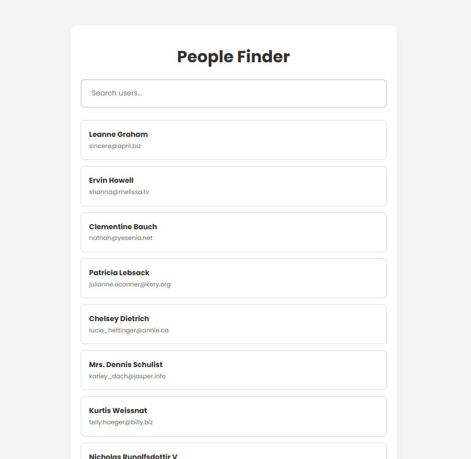

# User Explorer

A simple React application that fetches users from a public API and allows searching and filtering through a clean and responsive interface.

## ✨ Features
- [x] **Asynchronous Data Fetching**: Consuming REST API using Hooks (`useEffect` and `fetch`).
- [x] **Real-time Search**: Dynamic filtering logic based on user input.
- [x] **State Management**: Centralized control for loading, error, and data states.
- [x] **Design System Approach**: Architecture based on global CSS variables (Design Tokens).
- [x] **Component-based Architecture**: Reusable UI components for better maintenance.
- [ ] **Responsive Layout**: Clean interface that works on different screen sizes.
- [ ] **User Avatars**: Integration with profile picture APIs (DiceBear/Pravatar).
- [ ] **Grid System**: Two-column layout for enhanced desktop visualization.
- [ ] **Dark Mode**: Theme switching support based on system preferences.

## 🛠️ Technologies Used
- React
- JavaScript
- CSS

## 🚀 Getting Started

To get a local copy up and running, follow these simple steps:

### Prerequisites
* **Node.js**: v18.0.0 or higher
* **npm**: (comes with Node.js)

### Installation & Setup

1. **Clone the repository**
   ```bash
   git clone [https://github.com/your-username/people-finder.git](https://github.com/your-username/people-finder.git)
   ```
2. **Navigate to the project directory**
   ```bash
   cd people-finder
   ```
4. Install dependencies
   ```bash
   npm install
   ```
6. Start the development server
   ```bash
   npm run dev
   ```
8. Open your browser
   Navigate to http://localhost:5173 to see the application running.

## 🖼️ Assets
- Data provided by: [JSONPlaceholder](https://jsonplaceholder.typicode.com/)
- Typography: [Poppins](https://fonts.google.com/specimen/Poppins)

## 📄 License
This project is for educational purposes.

🖥️ Preview

> Example of the project interface.
